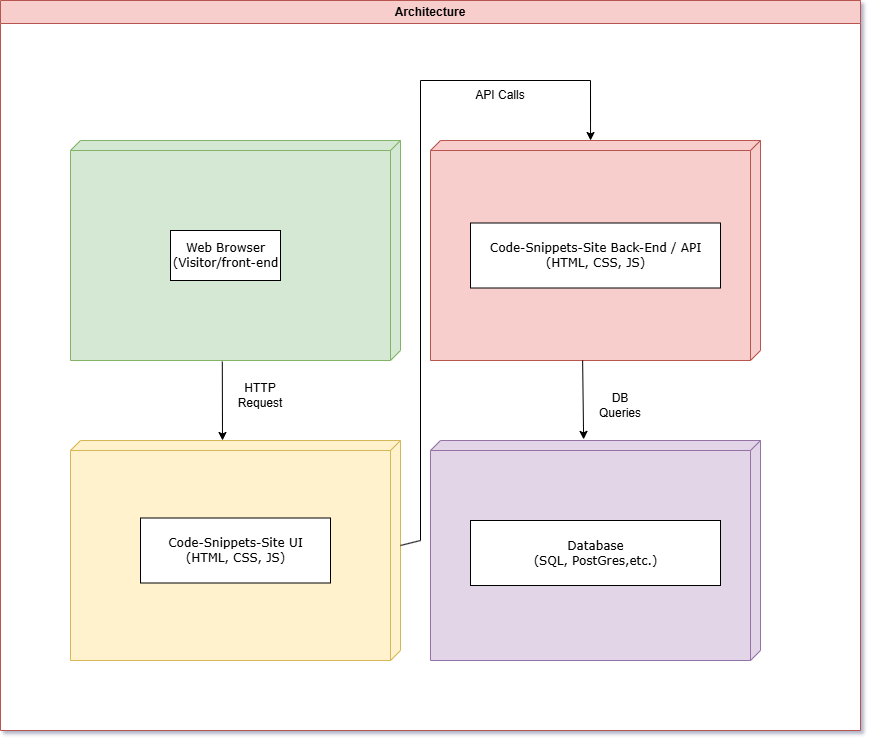

# Code-Snippets-Site
A website with web-applications showcasing code snippets and data structure concepts for reference. 

# **Code-Snippets-Site**  
A user-friendly website showcasing **concise code snippets** for learning data structures, algorithms, and essential programming concepts.

---

## **Table of Contents**  
1. [Overview](#overview)  
2. [Features](#features)  
3. [Solution Architecture Diagram](#solution-architecture-diagram)  
4. [Wireframes](#wireframes)
5. [User Stories](#user-stories)
6. [Use Case Diagram](#use-case-diagram) 

---

## **Overview**  
**Code-Snippets-Site** is dedicated to helping developers—beginners and pros—explore various **data structures** and **programming techniques**. The platform provides a **navigation bar** linking to topics like Arrays, Linked Lists, Sorting Algorithms, and more. Each topic page displays:

- **Highlighted code snippets** with brief explanations.  
- **Complexity insights** or best practices.  
- Real-world use cases where applicable.

This repository contains the **front-end**, **back-end (API)**, and **database schema** all in one place. Below, you will find **design documents**, **wireframes**, and **usage instructions**.

---

## **Features**  
- **Structured Navigation**: Quickly jump to categories like **Arrays**, **Stacks**, **Trees**, or **Sorting**.  
- **Code Highlights & Explanations**: Learn at a glance with well-formatted code and bullet-point summaries.  
- **RESTful API**: Easily expand or modify snippet content via simple endpoints.  
- **Search Functionality (Planned)**: Filter snippets by language or keyword.  
- **Community Contributions (Future)**: Allow users to add or rate snippets.

---

## **Solution Architecture Diagram**  
Below is a high-level overview of the system architecture: (DRAFT)

## **Wireframes**
Draft wireframe sketches to visualize the layout and user flow: (DRAFT)

## **User Stories**
Below are **five** user stories demonstrating how different users will interact with the system:
- **As a** new developer, **I want** to browse code snippets by category, **so that I can** quickly learn about concepts I currently need to learn about.
- **As a** curious visitor, **I want** to see code snippets with explanations, **so that I can** how some code works in practice.
- **As a** developer, **I want** to have the ability to search for specific subjects, **so that I can** find specific topics or languages more easily.
- **As a** researcher, **I want** filter snippets by language, **so that I can** see examples relating to the languages I use.
- **As a** self-learner, **I want** to understand certain implementations of code and their complexities **so that I can** compare different solutions.

## **Use Case Diagram**

- **UC-01:** Browse Snippets by Category  
**Actor:** Site Visitor  
**Description:** The user clicks a category (e.g., “Arrays”) to view all associated code snippets.  
**Preconditions:** Categories exist in the database (or file structure).  
**Normal Flow:**  
-User selects a category from the navigation bar (Coding concept).  
-System queries the backend for snippets tagged with that category.  
-System displays the retrieved snippet listings.  
**Postconditions:** The user can see an overview of all snippets in that category.  
**Exceptions:** If no snippets exist under the chosen category, a “No snippets found” message is displayed.  

- **UC-02:** View Snippet Detail  
**Actor:** Visitor  
**Description:** The user clicks on a specific snippet to see the full code and explanation.  
**Preconditions:** The snippet ID or reference exists.  
**Normal Flow:**  
-User clicks the snippet title or “View Details.”  
-System retrieves snippet data (title, code, explanation, complexity) from storage.  
-System displays the snippet detail page with formatted code and notes.  
**Postconditions:** The user can read or copy the snippet code and see its explanation.  
**Exceptions:** If the snippet ID is invalid or missing, an error or “Snippet not found” page is shown.  

- **UC-03:** Search Snippets  
**Actor:** Visitor  
**Description:** The user enters a keyword (e.g., “bubble sort”) into a search bar to find matching snippets.  
**Preconditions:** The system implements a basic search functionality (title, tags, or description).  
**Normal Flow:**  
-User types a keyword and submits the search query.  
-System checks the database or in-memory collection for matching snippets.  
-System displays a list of relevant snippet titles and short descriptions.  
**Postconditions:** The user sees all snippets that match the search keyword.  
**Exceptions:** If there are no matches, the system shows a “No results found” message.  

- **UC-04:** Filter Snippets by Language  
**Actor:** Visitor  
**Description:** The user applies a language filter (e.g., “JavaScript,” “Python”) to see only snippets in that language.  
**Preconditions:** Snippets are tagged or categorized by language in the database.  
**Normal Flow:**  
-User selects a language from a dropdown menu or filter section.  
-System queries the snippet collection for the chosen language.  
-The filtered list of snippets is displayed.  
**Postconditions:** The user sees only snippets written in the specified language.  
**Exceptions:** If no snippets exist in that language, show “No snippets found.”  

- **UC-05:** View Time Complexity Info  
**Actor:** Visitor  
**Description:** The user views the time complexity or performance notes for a selected snippet.  
**Preconditions:** Each snippet includes a property/field for complexity (e.g., O(n), O(n log n)).  
**Normal Flow:**  
-User opens the snippet detail page.  
-The system displays a short explanation of the snippet’s runtime complexity and any relevant performance considerations.  
-The user reads and gains insight into the snippet’s efficiency.  
**Postconditions:** The user understands the snippet’s time complexity.  
**Exceptions:** If no time complexity data is provided for a snippet, show a placeholder or “Not provided” text.  